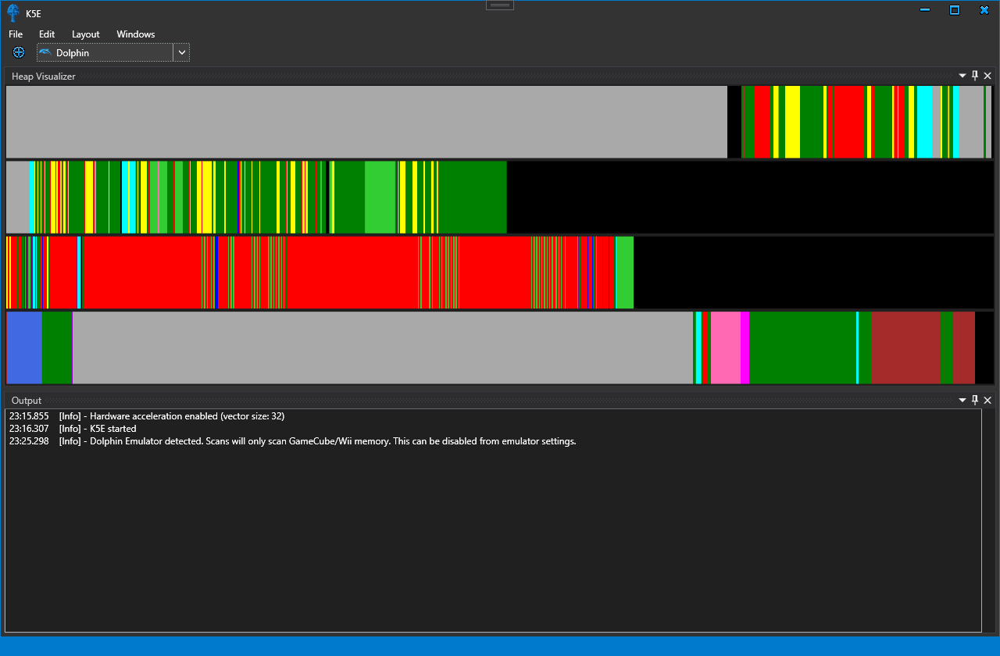

# K5E

K5E is a heap visualizer for Star Fox Adventures to help collect the 5th Krazoa Spirit early.

The code for this visualizer is ported from two projects:
1) [RenaKunisaki's script](https://github.com/RenaKunisaki/StarFoxAdventures/blob/master/misc-scripts/identifyPointer.py) - For the heap parsing logic
2) [Squalr](https://github.com/Squalr/Squalr/) - For the memory scanning libraries and window docking

